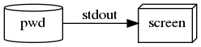

# Pourquoi linux ?

> Write programs that do one thing and do it well.

> Write programs to work together.

> Write programs to handle text streams, because that is a universal interface.

# Pourquoi apprendre les utilitaires de base linux ?

* Simple: do one thing
* Flexible: built for reuse
* Fast : no graphics overload
* Ubiquitous: available on all machines
* Permanent: 40 years so far...

# le shell

> A Unix shell is a command-line interpreter or shell that provides a traditional Unix-like command line user interface. Users direct the operation of the computer by entering commands as text for a command line interpreter to execute, or by creating text scripts of one or more such commands __ wikipedia


# bash

> Bash is a command processor that typically runs in a text window, where the user types commands that cause actions  __ wikipedia

Le `$` en début de ligne est appelé le "prompt".


# exit

```
$ bash
$ exit
```

# echo

```
$ echo
$ echo "ATGC"
$ echo -n "ATGC"
$ echo -e  ">seq\nATGC"
$ echo -e -n  ">seq\nATGC"
```


# man

```
$ man echo
$ man man
```


# info

```
$ info echo
$ man info
```


# whatis

```
$  whatis echo
$  man whatis
```


# le systeme de fichier

* 'home'
* 'root'

```
/home/lindenb/about.linux/
+-- LINUX
|   +-- BIO
|       +-- FASTA
|       |   +-- chrM.fa.gz
|       |   +-- sequences.fa
|       +-- GOA
|       |   +-- goa.tsv.gz
|       +-- VCF
|           +-- 10000genomes.vcf.gz
|           +-- dbsnp137.vcf.gz
+-- Makefile
+-- linux.pdf
+-- linux.tex
```


# path

* "A Unix/Linux pathname is a text string made up of one or more names separated by slashes"
*  Destination object may be file, directory, or other
* `.` current directory
* `..` parent directory
* `/` root directory
* `/home/user/directory/file.txt` : absolute path
* `directory/file.txt`: relative path to the current directory. Same as `./directory/file.txt`


# pwd

Print working directory. Où suis-je ?

```
$ man pwd
$ pwd
```



# ls

Lister les fichier et dossiers.

```
$ man ls
$ ls
$ ls .
$ ls ~
$ ls /
$ ls ../
$ ls ../..
$ ls -1 /
$ ls -l /
$ ls does_not_exists
``` 


* file globbing

```
$ ls /home/*
``` 


* shell completion

# cd

```
$ cd ..
$ cd .
$ cd 
$ cd ~
$ cd /
$ cd -
``` 


# mkdir

créer un dossier

```
$ mkdir dir1 dir2 dir3
$ mkdir -p a/b/c/d
```


# cp

copier un fichier ou un dossier 

```
$ cp file1.txt file2.txt
$ mkdir dir1 
$ cp file1.txt dir1/
$ cp file1.txt dir1/file3.txt
$ mkdir dir2
$ cp -r dir1 dir2/
```


# rm

```
rm file1.txt
rm -rf dir1
rm  does_not_exits.txt
rm -f does_not_exits.txt
```

# rmdir

```
mkdir dir1
rmdir dir1
```

# man

```
man tar
man man
```


# stdandard input

# stdandard output (stdout)

# stdandard error (stderr)

# seq

```
$ seq 10
$ seq 2 9
$ seq 2 3 9
```


# cat

```
$ cat file1.txt
```


# stop input stdin : Ctrl-D

```
$ cat
```


# stop a processus Ctrl-C

```
$ seq 1 10000000
```


# bc

```
Copyright 1991-1994, 1997, 1998, 2000, 2004, 2006 Free Software Foundation, Inc.
This is free software with ABSOLUTELY NO WARRANTY.
For details type `warranty'. 
1+1
2
3-3
0
```


# redirection

* `|`  (pipe) redirects standard output of a program as standard input of another.
* `>` redirects standard output to a file (and overwrites the file if it already exists).
* `<` uses a file as standard input.
* `>>` Appends standard output to a file.

```
$ echo "ATGC" | cat
$ echo "3*6" | bc
$ ls / | cat
```

# redirect stderr/stdout


```
ls /root /bin 1> stdout.txt
ls /root /bin 2> stderr.txt

```


# grep

```
$ echo -e ">gene1\nATGGAATTCAAAA\n>gene2\nCCCTGCTGATCGATCGATCGT" | grep AT
$ echo -e ">gene1\nATGGAATTCAAAA\n>gene2\nCCCTGCTGATCGATCGATCGT" | grep GAATTC
$ echo -e ">gene1\nATGGAATTCAAAA\n>gene2\nCCCTGCTGATCGATCGATCGT" | grep  GAATTC
$ echo -e ">gene1\nATGGAATTCAAAA\n>gene2\nCCCTGCTGATCGATCGATCGT" | grep -B1 GAATTC
$ echo -e ">gene1\nATGGAATTCAAAA\n>gene2\nCCCTGCTGATCGATCGATCGT" | grep -A1 GAATTC
$ echo -e ">gene1\nATGGAATTCAAAA\n>gene2\nCCCTGCTGATCGATCGATCGT" | grep -E '(GAATTC|CCT)' 
```


# AND & OR

```
$ echo "AATATATATATATA" | grep CCC ; echo ALWAYS
$ echo "AATATATATATATA" | grep CCC && echo NEVER
$ echo "AATATATATATATA" | grep -v CCC && echo ALWAYS
$ echo "AATCCCCCTATATA" | grep CCC && echo ALWAYS
```


# more

```
$ seq 1 1000000 |more
```

# nano

```
$ nano file1.txt
```

# wc

```
$ seq 1 1000000 | wc
$ seq 1 1000000 | wc -c
$ seq 1 1000000 | wc -l
$ echo | wc -c
$ echo -n | wc -c
```
# paste

```
$ seq 1 10 > a && seq 2 12 > b && paste a b
$ seq 1 20 | paste - -
$ seq 1 20 | paste - - -
$ seq 1 20 | paste -s -d '+' | bc
```

# sed

```
$ echo "GAATTCCGAATTC" | sed 's/GAATTC/-EcoRI-/'
$ echo "GAATTCCGAATTC" | sed 's/GAATTC/-EcoRI-/g'
$ echo "GAAAAATTCCGAATTC" | sed -r 's/A{2,}/-polyA-/g'
$ echo "GAAAAATTCCGAATTC" | sed   's/\([AT][CG]\)/\-\1\-/g'
$ seq 1 22 | sed 's/^/chr/'
```


# awk

```
$ echo -e "G1\tATAGCTACG\nG2\tATCGTACGATCG" | awk '{printf(">%s\n%s\n",$1,$2);}'
$ seq 1 99 | paste - - - | awk '($2%10==0 && $2<80)'
```

# touch 

```
$ touch file_does_not_exists
```

# find

```
$ find ~ -type f
$ find ~ -type f -name "*.fasta"
$ find ~ -type f -name "*.fasta" -exec wc -l '{}' ';'
```

# sort

```
$ seq 1 10 | sort
$ seq 1 10 | sort -n
$ seq 1 10 | sort -n -r
$ seq 1 33 | paste - - - | sort  -t $'\t' -k2,2n
$ seq 1 33 | paste - - - | sort  -t $'\t' -k2,2n 
$ seq 1 33 | paste - - - | sort  -t $'\t'  -k3,3r -k2,2n
```

# uniq

```
$ echo -e "A\nA\nA\nB\nB\nA" | uniq
$ echo -e "A\nA\nA\nB\nB\nA" | sort | uniq
$ echo -e "A\nA\nA\nB\nB\nA" | sort | uniq -c
$ echo -e "A\nA\nA\nB\nB\nA" | sort | uniq -c | sort -n
```

# comm

```
$ seq 1 20 | sort > a && seq 10 30 | sort > b && comm a b
$ seq 1 20 | sort > a && seq 10 30 | sort > b && comm -1 a b
$ seq 1 20 | sort > a && seq 10 30 | sort > b && comm -2 a b
$ seq 1 20 | sort > a && seq 10 30 | sort > b && comm -3 a b
$ seq 1 20 | sort > a && seq 10 30 | sort > b && comm -12 a b
```

# join

```
$ seq 1 22  | awk '{printf("chr%s gene%d\n",$1,$1);}'| sort -t ' ' -k1,1 > a && \
  seq 10 30 | awk '{printf("chr%s variant%d\n",$1,$1);}' | sort -t ' ' -k1,1 > b && \
  join -t ' ' -1 1 -2 1 a b
```

# tr

```
$ echo "ATAAAAACGACTTTTGA" | tr "T" "U"
$ echo "ATAAAAACGACTTTTGA" | tr -s "A"
$ echo "ATAAAAACGACTTTTGA" | tr -d "A"
```

# xargs

```
$ seq 1 10 | xargs echo Chromosomes
$ seq 1 10 | xargs echo Chromosomes
$ seq 1 10 | xargs -n 2 echo Chromosomes
$ seq 1 10 | xargs -i  echo {} chr
```

# gzip

```
$ gzip file.txt
$ seq 1 100000 | wc -c
$ seq 1 100000 | gzip | wc -c
```

# gunzip 

```
$ gunzip file.txt.gz
$ gunzip -c file.txt.gz
$ seq 1 10 | gzip | gunzip 
```


# file

```
$ file file.txt
$ echo "ATAGCTA" | file -
$ echo "ATAGCTA" | gzip | file -
```


# diff

```
$ seq 1 20 > a && seq 10 30 > b && diff a b
```

# sdiff

```
$ seq 1 20 > a && seq 10 30 > b && sdiff a b
```

# rev

```
$ echo "AAAAAATTTTGGGGGCCC" | rev
```

# split

```
$ seq 1 100 | split -l 10 - tmp_
```

# head

```
$ seq 1 10000 | head
```

# tail

```
$ seq 1 10000 | tail
```

# cut

```
$ seq 1 10000 | paste - - - - - | cut -f 3
$ seq 1 10000 | paste - - - - - | cut -f 3-
$ seq 1 10000 | paste - - - - - | cut -f 2-4
$ seq 1 10000 | paste - - - - - | cut -f -2
$ seq 1 10000 | paste - - - - - | cut -f 1,5

$ echo "ABCDE" | cut -c 2
$ echo "ABCDE" | cut -c 2,5
$ echo "ABCDE" | cut -c 2-5
```

# fold

```
$ echo -e ">Gene1\nATCGATCGATCGATGACTAGCTAGTCATCGATCGACTGATCTACGTC" | fold -w 10
```

# tar

```
$ touch a b c && tar cvfz archive.tar.gz a b c
$ tar tvfz archive.tar.gz
$ tar xvfz archive.tar.gz
```

# zip

```
$ touch a b c && zip archive.zip a b c
$ unzip -t archive.zip
$ unzip -o archive.zip
```

# wget

```
$ wget  -q -O -  "https://eutils.ncbi.nlm.nih.gov/entrez/eutils/efetch.fcgi?db=nucleotide&id=NM_007299.3&id=NR_027676.1&id=NM_007299.3&id=NM_007298.3&retmode=xml"
$ wget  -q -O -  "https://eutils.ncbi.nlm.nih.gov/entrez/eutils/efetch.fcgi?db=nucleotide&id=NM_007299.3&id=NR_027676.1&id=NM_007299.3&id=NM_007298.3&rettype=fasta"
```

# shell script

contenu du fichier `action`

```
echo Hello
seq 1 10
ls /
```

executer ce fichier:

```
bash action
```

# loop

```
for F in A B C
do
    echo "F=${F}"
done
```

```
seq 1 10 | while read F
do
    echo "F=${F}"
done
```

# test


```
if  [ -f "file.txt ] ; then
    echo "file.txt exists"
else
    echo "file.txt doesn't exists"
fi
```

```
if [ 1 -gt 10 ] ; then
    echo "Math is wrong"
fi
```

# sqlite


```
$ echo "create table CHROM(name);" > q.sql 
$ seq 1 22 | awk '{printf("insert into CHROM(name) values (\"chr%s\");\n",$1);}' >> q.sql
$ echo  "select name from CHROM WHERE substr(name,1,4)='chr1' limit 5;" >> q.sql 
$ sqlite3 tmp.sql < q.sql
```

# make

Makefile:

```
all.rna: a.rna b.rna
	cat $^ > $@

a.rna: a.dna
	tr "T" "U" < $< > $@
a.dna
	echo "ATGACTGCTGATCG" > $@
b.rna: b.dna
	tr "T" "U" < $< > $@
b.dna
	echo "ATGACTGCTGATCG" > $@
```

then

```
make
```

# git

```
$ mkdir test 
$ cd test
$ git init
$ echo "Hello" > README.txt
$ git add README.txt
$ git commit -m "first commit"
$ rm README.txt
$ git checkout README.txt
```

# heredoc

```
cat << HERECOMESTHESUN > my.code
\documentclass[12pt]{article}
\begin{document}
Hello world!
\end{document}
HERECOMESTHESUN
```


# latex

```
cat << HERECOMESTHESUN > tmp.tex
\documentclass[12pt]{article}
\begin{document}
Hello world!
\end{document}
HERECOMESTHESUN
$ pdflatex tmp.tex 
$ evince tmp.pdf
```

# C compiler

```
$ cat tmp.c
#include <stdio.h>
int main(int argc,char** argv) {
printf("Hello world\n");
return 0;
}

$ gcc -o hello tmp.c
```

# dot

```
$ echo 'digraph G { A -> B; C -> B; B -> C }' | dot -T png -o out.png
```


## Links

 * https://astrobiomike.github.io/unix/getting-started
 * http://korflab.ucdavis.edu/Unix_and_Perl/current.html
 *
